# Extending PlayFab: Reacting to PlayStream Events with Azure Functions
> by Johannes Ebner – Technical Specialist, Global Black Belt Gaming Team

# Introduction
As my teammate Andreas Pohl wrote in his article [Build vs. Buy - Which online service is right for my game](https://developer.microsoft.com/en-us/games/blog/build-vs-buy-which-online-service-is-right-for-my-game/), PlayFab is a great way to get started with a backend for your game.

Now you started with PlayFab and you have come to the point where you want to extend the functionality with your own game logic, for example by leveraging [Azure PlayFab's PlayStream](https://docs.microsoft.com/en-us/gaming/playfab/features/automation/playstream-events/) and reacting to it's events. How would you do that?

Good news: PlayFab has an integration with [Azure Functions](https://azure.microsoft.com/en-us/services/functions/)! In this article, I will show you how you can react to PlayStream Events with Azure Functions and Azure Storage.

## Discourse: What are Azure Functions?
From the [official documentation](https://docs.microsoft.com/en-us/azure/azure-functions/functions-overview):
> Azure Functions allows you to run small pieces of code (called "functions") without worrying about application infrastructure. With Azure Functions, the cloud infrastructure provides all the up-to-date servers you need to keep your application running at scale.
>
> A function is "triggered" by a specific type of event. [Supported triggers](https://docs.microsoft.com/en-us/azure/azure-functions/functions-triggers-bindings) include responding to changes in data, responding to messages, running on a schedule, or as the result of an HTTP request.
>
> While you can always code directly against a myriad of services, integrating with other services is streamlined by using bindings. Bindings give you [declarative access to a wide variety of Azure and third-party services](https://docs.microsoft.com/en-us/azure/azure-functions/functions-triggers-bindings).

## Goal
This is a detailed end-to-end example on how to extend Azure PlayFab with Azure Functions.

We will be using C# & .NET Core to create an Azure Function and bind it to a [PlayStream Event](https://docs.microsoft.com/en-us/gaming/playfab/features/automation/playstream-events/). The event to bind to will be the `player_created` Event, which fires every time a new player registers. The binding will then call the Azure Function.

This Azure Function will add "User Data" to this new Player.

> Title User Data is title-specific custom data for the user which is readable and writable by the client. But you can of course set this via the Server as well. Player Data and User Data are terms used interchangeable within PlayFab terminology. Please refer to the [documentation](https://docs.microsoft.com/en-us/gaming/playfab/features/data/playerdata/quickstart) for more information.

## Prerequisites

### Editor/IDE
While you can follow along with basically any Editor/IDE, I will be using [Visual Studio 2019](https://visualstudio.microsoft.com/) (you may use the the free Visual Studio 2019 Community Edition!) because it has all the batteries included for our tasks ahead.

> If you do not use Visual Studio, but want to use another IDE/Toolset, there are examples for creating & publishing Azure Function Apps with [Visual Studio Code](https://docs.microsoft.com/en-us/azure/azure-functions/functions-create-first-function-vs-code?pivots=programming-language-csharp) or via [CLI](https://docs.microsoft.com/en-us/azure/azure-functions/functions-create-first-azure-function-azure-cli?tabs=bash%2Cbrowser&pivots=programming-language-csharp).

### Azure Access
If you do not yet have used Azure, you [sign up for free](https://azure.microsoft.com/en-us/free/gaming/) and get some additional goodies with [Visual Studio Dev Essentials](https://visualstudio.microsoft.com/dev-essentials/) program.

### Azure PlayFab access
And, of course, since this is a Tutorial on how to use [Azure PlayFab](https://playfab.com/), you need an existing Title on PlayFab as well. You could use the same Microsoft Account you used for signing up to Azure. Remember: There is a [free tier to get you started](https://developer.playfab.com/en-US/sign-up)!

# Getting Started
As there are so many languages and platforms supported by Azure PlayFab and Azure Functions, I had to decide for one and chose the language and platform I am best in: Pure C# & .NET Core. But there are great guides for various Game Engines like Unity and Unreal, and PlayFab provides SDKs for a plethora of languages that are very similar to the C# SDK because they are all auto-generated from the same REST API.

So while this is C#, most of what we do here is very similar in other languages/runtimes

## Project Setup
### Create an Azure Functions Project
To create an Azure Functions Project, either use the splash screen (see screenshot below) or use File --> New Project…

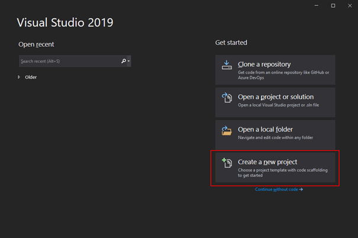

Select the project type “Azure Functions” and click “Next”

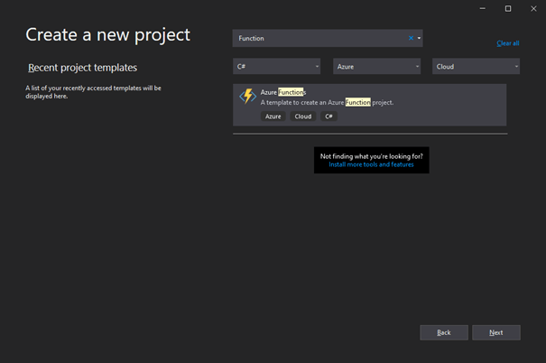

Choose a name for your Project and select the folder for it to be placed in:

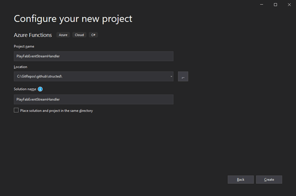

This will create a folder named according to your Solution name, in which it will create another folder for the project, with the Project’s name you chose.

Now, in the next dialog, you may either choose an `HttpTrigger` or a `QueueTrigger` for your Function. Please choose `QueueTrigger`

> Please be aware that Azure PlayFab terminates PlayStream-invoked Azure Functions after 1 second, thus `QueueTrigger` is the better choice here since it will immediately yield back to Azure PlayFab.

For the Storage Account drop-down, you may use Storage Emulator (which comes with Visual Studio or you can use the new ["Azurite"](https://docs.microsoft.com/en-us/azure/storage/common/storage-use-azurite), which is the new generation of the Storage Emulator) or click “Browse…” to select a storage account. As we will need to test it with Azure PlayFab anyways, let’s go ahead and use an Azure Storage Account. Pelase click "Browse " to create a new Storage Account:

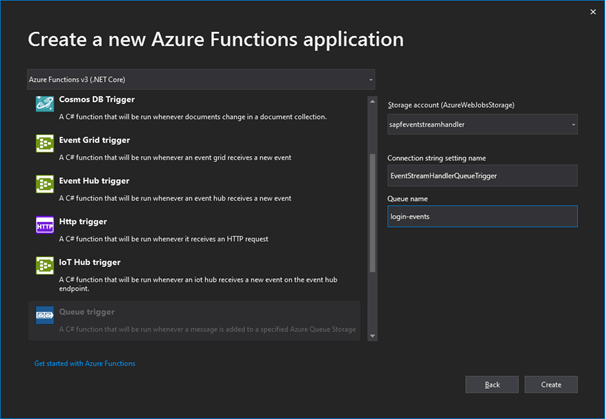

In the next dialog, click "Create a storage account"
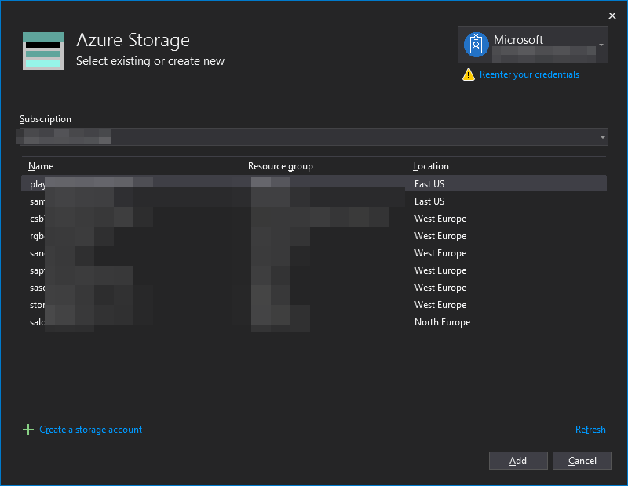

When creating the storage account, make sure to create a unique name. It actually has to be globally unique, because it will be part of the URI. You will see a warning if it is not unique.

Also, you should create a new resource group for this project. A resource group is basically the topmost container in Azure and can contain all the different resources we are going to create. For example, if you want to remove all of the things we are creating in this article, you could just remove the resource group. [You can read more about the Resource Manager deployment model and resource groups in the documentation](https://docs.microsoft.com/en-us/azure/azure-resource-manager/management/overview).

Last, let's think about the Account type. While it is enough for the sake of this tutorial to choose "LRS - Locally Redundant Storage", it it is worth considering [other redundancy options](https://docs.microsoft.com/en-us/azure/storage/common/storage-redundancy) for different use-cases.

Click "Create" when you have filled all fields and created a resource group.

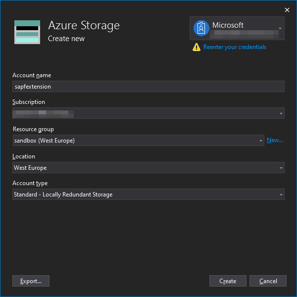

Now back to the Storage Account select screen, select the one you just created and click "Add".

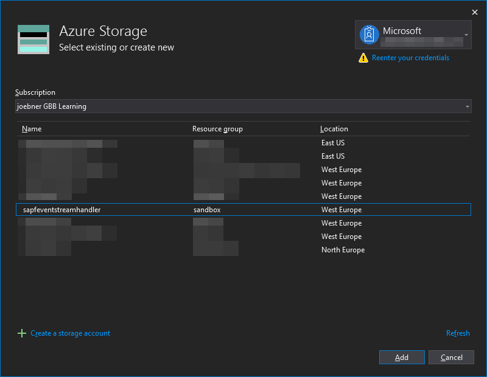

The Storage Account should now appear in the drop-down, beneath "Storage Emulator" and "Browse...". Select it.

I would advise to leave "Connection string setting name" empty for now. Using this would create a new setting and would be a bit confusing for now.

For "Queue name", make up a name for the storage queue (which we will actually create later). It does not have to have a unique name, but it may only use characters, numbers and dashes.

Just call it `login-events` for now.

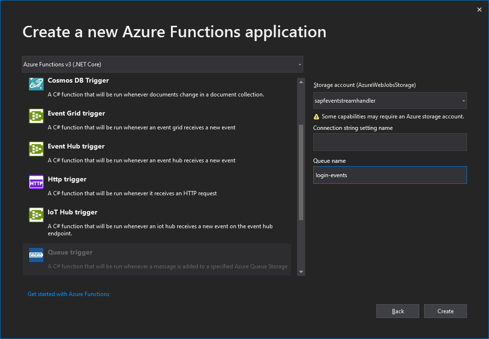

Once you are done setting up the Storage Account configuration, click the “Create” button and wait for the project to generate. Visual Studio will eventually open the project and show you the code of the generated Azure Function stub (your namespace name may vary):

    using System;
    using Microsoft.Azure.WebJobs;
    using Microsoft.Azure.WebJobs.Host;
    using Microsoft.Extensions.Logging;
    
    namespace PlayFabEventStreamHandler
    {
        public static class Function1
        {
            [FunctionName("Function1")]
            public static void Run([QueueTrigger("login-events", Connection = "")]string myQueueItem, ILogger log)
            {
                log.LogInformation($"C# Queue trigger function processed: {myQueueItem}");
            }
        }
    }

<!-- 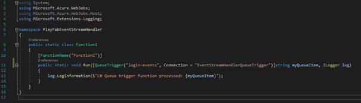 -->

> You might have noticed, that the Function was creatively named `Function1`, because Visual Studio just does not know what we what to do. Please rename the File, Class and the Function name in the Annotation as `PlayStreamEventHandler`.

> Renaming is done easiest in Visual Studio by right-clicking the Class name in the code editor and selecting "Rename" (or just press F2). This will open a tiny dialog asking you where you want to replace. Select "Rename file" and "Include strings". This will make sure Class and File are renamed as well as the Attribute string.

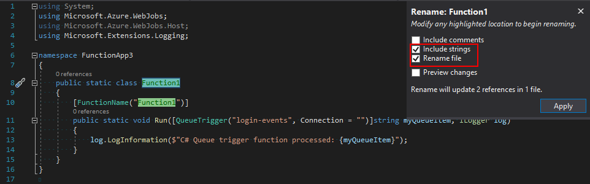

While asking for a Connection string setting in the dialog, we did not give it a name. The reason is, that Visual Studio adds a connection string by default, called `AzureWebJobsStorage`. This is set in the `local.settings.json` config file:

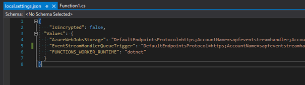

> `local.settings.json` is a config file *only* for local configuration. For deployed functions, you can either use the [Application Settings built into Azure Functions](https://docs.microsoft.com/en-us/azure/azure-functions/functions-how-to-use-azure-function-app-settings), or for more advanced scenarios, you could use [Azure App Config](https://docs.microsoft.com/en-us/azure/azure-app-configuration/overview).

But because we did not give the connection setting a name earlier, there was no name set in the function. If you look closely at the Azure Function code, you can spot it in the Signature of the `Run` method. Look at the `Connection = ""` property of the `QueueTrigger` attribute:

    public static void Run([QueueTrigger("login-events", Connection = "")]string myQueueItem, ILogger log)

We just need to put in `AzureWebJobsStorage` instead of the empty string to load the right connection string:

    public static void Run([QueueTrigger("login-events", Connection = "AzureWebJobsStorage")]string myQueueItem, ILogger log)

### Add the Azure PlayFab package
The Azure PlayFab SDK for C# is available via NuGet. You can either add the latest version via the dotnet CLI

    dotnet add package PlayFabAllSDK

Or via the NuGet package manager in Visual Studio:
Right-click “Dependencies” and click “Manage NuGetPackages”

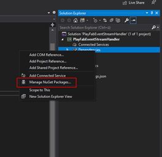

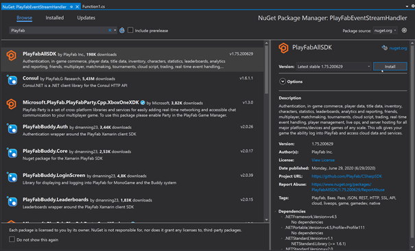

Open the “Browse” tab and search for PlayFab. Select the `PlayFabAllSDK` and click “Install” on the details pane to install. You might need to accept licenses when you do.

> Please note: you should also update the installed packages because the Visual Studio template ships with a slightly older version of the SDKs for Azure Functions and WebJobs Storage.

### Test the Function
In Visual Studio, press F5 (or click Build --> Debug) to launch the local Azure Functions runtime in debug mode.

Now, let’s create a test message. To do this, go to the Azure Portal and open up your Storage Account’s Queue blade:

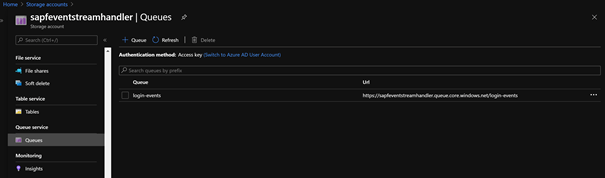

If you haven’t already created a Queue here, do so now by clicking the “+ Queue” button. Make sure to use the same name you specified when creating the Azure Function with the Queue Trigger (see screenshot below).

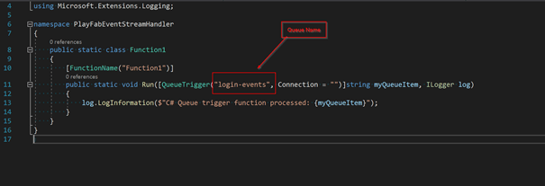

Once you have created the Queue, click the Queue entry in the Portal to get to the detail Blade.
Here, click “+ Add message”. In the new Dialog, just add some text and click “OK”.

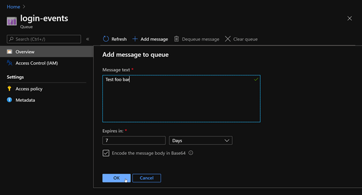

Now watch the console window of your function: it will log out how it processes the queue message you just added!

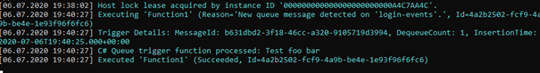

Checking back in the Azure Portal’s view of the Queue, you click the “Refresh” button to see how the message disappeared, because it got processed.

# Set up PlayFab
To call your Azure Function from Azure PlayFab, we need to register the Function binding via the Azure Storage Queue and set up an Event Trigger (aka *“Rule”*).

## Register the Function
Log in to [Azure PlayFab](https://playfab.com/) and click on the Title you want to register the Azure Function for.

Once you are in the Title’s overview, click “Automation” (1), which opens the “Cloud Script” tab. In this tab, select the sub-tab “Functions (Preview)” (2), which will list all the previously registered Azure Functions. Now click the big orange button in the top right labeled “REGISTER FUNCTION” (3) to open the registration dialog.

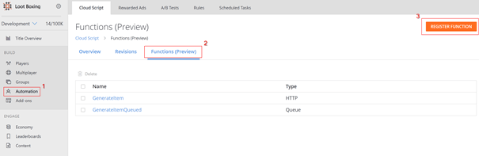

Let'S go through the individual settings for a registration:

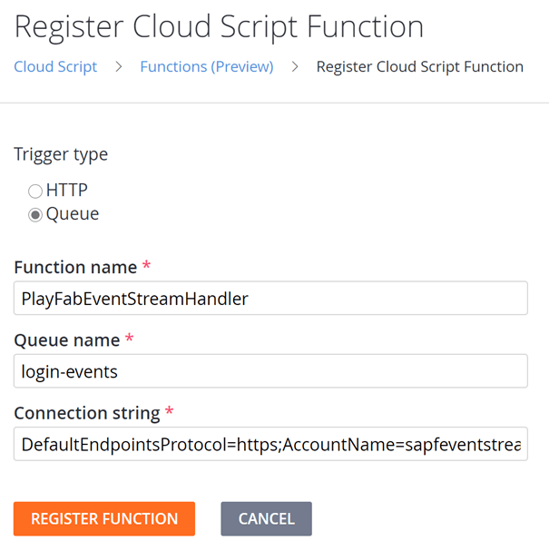

* Trigger type: set to “Queue”
* Function name: This is not actually the name of the Azure Function you deployed, but the name of the binding we’re currently setting up – so it’s the identifier you will be working with from PlayFab. Choose a name that fits your needs!
* Queue name: this is the queue name the `QueueTrigger` of the Azure Function listens to. In the examples above, this was `login-events`.
* Connection string: The ConnectionString to the Azure Storage Account Queue.

To finish registering the Function registration, click *“REGISTER FUNCTION”*. The Registration should now appear in the overview.

## Set up a Rule
To set up a Rule, within a PlayFab Title, go to *“Automation”* (1) in the left pane, select the *“Rules”* Tab (2) and click *“NEW RULE”* (3).

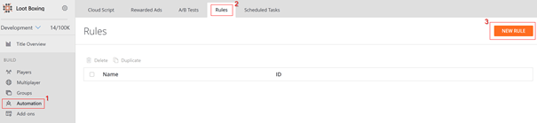

A Rule is a configuration that listens on a [*PlayStream* event](https://docs.microsoft.com/en-us/gaming/playfab/features/automation/playstream-events/) emitted by Azure PlayFab. When such an event occurs, the Rule checks whether the configured Conditions are met and if they are, triggers the configured *Action*.

In our case, we want no conditions, but want to “Execute Azure Function”. In fact, what it does, is calling its own internal binding we just set up and provides it the PlayStream event data and additional arguments you may specify here (in JSON format) as argument to that binding.

When that binding is called, it will either call the Function via HTTP trigger, or, as we configured it, by writing the data to the storage queue for the Azure Function to pick up via a `QueueTrigger`.

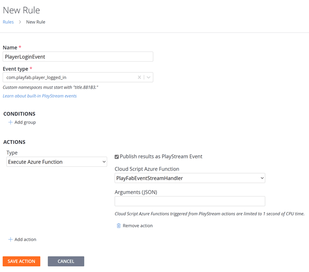

Click “*SAVE ACTION*” to save (yes, this saves the Rule 😉). You should now see the Rule in the overview.

## Trigger the PlayFab Rule
Now we want to test the Rule and trigger the Azure Function via an Azure PlayFab PlayStream Event. To do this, we need to raise an event of type `com.playfab.player_logged_in`, as we specified when we created the Rule.

To achieve this, let’s create a small CLI application to log a Player in.

In Visual Studio, create a new .NET Core Application (preferably in the same Solution as the Function app) and then install the `PlayFabAllSDK`, just like above.

Now, you can paste the following C# code to your `Program.cs` to have a working program that signs into your game and if the Player does not yet exist, it will create a new one.

> Well, at least it is almost working. You need to substitute XXXX with your own Title ID. You can get the Title ID from your [Studio’s Overview Page](https://developer.playfab.com/en-US/my-games).

Below code listing as [GitHub Gist](https://gist.github.com/Structed/ff3190248833f40f611f0941f33793b9).

    using PlayFab;
    using PlayFab.ClientModels;
    using System;
    using System.Threading;
    using System.Threading.Tasks;

    namespace GameCli
    {
        class Program
        {
            private static bool running = true;
            static void Main(string[] args)
            {
                PlayFabSettings.staticSettings.TitleId = "XXXXX"; // Please change this value to your own titleId from PlayFab Game Manager
    
                var request = new LoginWithCustomIDRequest { CustomId = "Player-" + Guid.NewGuid(), CreateAccount = true };
                var loginTask = PlayFabClientAPI.LoginWithCustomIDAsync(request);
    
                while (running)
                {
                    if (loginTask.IsCompleted) // You would probably want a more sophisticated way of tracking pending async API calls in a real game
                    {
                        OnLoginComplete(loginTask);
                    }
    
                    // Presumably this would be your main game loop, doing other things
                    Thread.Sleep(1);
                }
    
                Console.WriteLine($"Done! Created new player named \"{request.CustomId}\". Press any key to close");
                Console.ReadKey(); // This halts the program and waits for the user
            }
    
            private static void OnLoginComplete(Task<PlayFabResult<LoginResult>> taskResult)
            {
                var apiError = taskResult.Result.Error;
                var apiResult = taskResult.Result.Result;
    
                if (apiError != null)
                {
                    Console.ForegroundColor = ConsoleColor.Red; // Make the error more visible
                    Console.WriteLine("Something went wrong with your first API call.  :(");
                    Console.WriteLine("Here's some debug information:");
                    Console.WriteLine(PlayFabUtil.GenerateErrorReport(apiError));
                    Console.ForegroundColor = ConsoleColor.Gray; // Reset to normal color
                }
                else if (apiResult != null)
                {
                    Console.WriteLine($"Was newly created? {apiResult.NewlyCreated}");
                    Console.WriteLine("Congratulations, you made your first successful API call!");
                }
    
                running = false; // Because this is just an example, successful login triggers the end of the program
            }
        }
    }

Now execute the program and watch how the event is executed in PlayFab via the PlayStream Monitor!

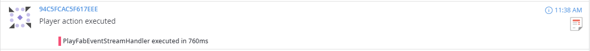

# Backend implementation
It's time to start the actual backend implementation!

## Using the PlayFab Context
Before we even get started with writing backend code, you will need a [Helper classes file](https://github.com/PlayFab/PlayFab-Samples/blob/master/Samples/CSharp/AzureFunctions/CS2AFHelperClasses.cs), provided by PlayFab. [Download the file](https://github.com/PlayFab/PlayFab-Samples/blob/master/Samples/CSharp/AzureFunctions/CS2AFHelperClasses.cs) and save it to your project. Here is why:

Every time a Function is triggered, The `Context` in which it was executed is sent as a parameter, The Context includes the following when the Function is triggered via a PlayStream Event:

* The Entity Profile
* The PlayStream event which triggered the script.
* A boolean that indicates whether a PlayStream event is sent as part of the function being executed
* The Payload data you specified when setting up the binding in PlayFab

> For more information on the Context and what it contains in other environments, please see the [Using CloudScript context models Tutorial](https://docs.microsoft.com/en-us/gaming/playfab/features/automation/cloudscript-af/cloudscript-af-context).

### Parsing the Context
We already receive the Context in the Function we have created, it is the `myQueueItem` parameter:

        [FunctionName("PlayStreamEventHandler")]
        public static void Run([QueueTrigger("login-events", Connection = "AzureWebJobsStorage")]string myQueueItem, ILogger log)
        {
            log.LogInformation($"C# Queue trigger function processed: {myQueueItem}");
        }

However, it is just a JSON string, and we want it to be parsed to a C# POCO ("Plain Old C# Object").

To do this, we first need the Class to convert to. The easiest way to do this is to download the [Helper classes file](https://github.com/PlayFab/PlayFab-Samples/blob/master/Samples/CSharp/AzureFunctions/CS2AFHelperClasses.cs), provided by PlayFab. It will contain all the Context Objects you need for the various deserialization use-cases.

Now, we can actually deserialize the Context to `PlayerPlayStreamFunctionExecutionContext`:

        [FunctionName("PlayStreamEventHandler")]
        public static void Run([QueueTrigger("login-events", Connection = "AzureWebJobsStorage")]string myQueueItem, ILogger log)
        {
            var context = JsonConvert.DeserializeObject<PlayerPlayStreamFunctionExecutionContext<dynamic>>(myQueueItem);
            log.LogInformation($"C# Queue trigger function processed: {myQueueItem}");
        }

## Authentication
Authentication in Azure PlayFab might seem a little bit overwhelming at first, but it enables high flexibility and best operational security by allowing you to only make requests in the relevant context.

For server-side actions, like we want to do here, this is particularly simple: we only need to set the `TitleId` and the `DeveloperSecretKey` on `PlayFabSettings.staticSettings`. Let's do that!

### Retrieving the `TitleId`
This one is the simplest - you can just get it from the context we have deserialized:

    PlayFabSettings.staticSettings.TitleId = context.TitleAuthenticationContext.Id;

### Retrieving the `DeveloperSecretKey`
The DeveloperSecretKey must be retrieved from the [Azure PlayFab Portal](https://developer.playfab.com/).

Log in and go to your Title you are working on.
Then, click the little cogwheel beneath your Title's name (1) and select "Title Settings" (2). Last, select the "Secret Keys" Tab (3)

On This page, go ahead and click "NEW SECRET KEY". Specify a name and click "SAVE SECRET KEY".

Now back on the Secret Key Overview, copy the secret key.

### Store the secret
Since we do not want to store the secret directly in the code, we will create a new setting `PlayFabDeveloperSecretKey` in `local.settings.json`. Substitute `<YOUR SECRET KEY>` with the secret you just copied from PlayFab:

    {
        "IsEncrypted": false,
        "Values": {
            "AzureWebJobsStorage": "<connection string to queue storage>"
            "PlayFabDeveloperSecretKey": "<YOUR SECRET KEY>",
            "FUNCTIONS_WORKER_RUNTIME": "dotnet"
        }
    }

### Authenticating using PlayFab Static Settings
Now that we have all the information, let's go ahead and put together the code.

Go to your Function's code, and paste the following code below your parsed context:

    PlayFabSettings.staticSettings.TitleId = context.TitleAuthenticationContext.Id;
    PlayFabSettings.staticSettings.DeveloperSecretKey = Environment.GetEnvironmentVariable("DeveloperSecretKey");
    
The function should now look like this:

    namespace PlayFabEventStreamHandler
    {
        public static class PlayStreamEventHandler
        {
            [FunctionName("PlayStreamEventHandler")]
            public static async Task Run([QueueTrigger("login-events", Connection = "AzureWebJobsStorage")] string myQueueItem, ILogger log)
            {
                var context = JsonConvert.DeserializeObject<PlayerPlayStreamFunctionExecutionContext<dynamic>>(myQueueItem);
                log.LogInformation($"C# Queue trigger function processed: {myQueueItem}");

                PlayFabSettings.staticSettings.TitleId = context.TitleAuthenticationContext.Id;
                PlayFabSettings.staticSettings.DeveloperSecretKey = Environment.GetEnvironmentVariable("DeveloperSecretKey");
            }
        }
    }

This is already all we need to make requests using `PlayFabServerAPI` or `PlayFabAdminAPI` - now we only need to make a request!

## Updating Player Data
Create a new Method `UpdatePlayerData` as below:

    private static async Task UpdatePlayerData(ILogger log, PlayerPlayStreamFunctionExecutionContext<dynamic> context)
    {
        var updateUserDataRequest = new PlayFab.ServerModels.UpdateUserDataRequest {
            PlayFabId = context.PlayerProfile.PlayerId,
            Data = new Dictionary<string, string> {
                {"<KEY>", "<VALUE>"}
            }
        };
        PlayFabResult<PlayFab.ServerModels.UpdateUserDataResult> result = await PlayFabServerAPI.UpdateUserDataAsync(updateUserDataRequest);
        
        if (playFabResult.Error != null)
        {
            log.LogError($"Code: {playFabResult.Error.Error}\n{playFabResult.Error.ErrorMessage}");
        }
    }

an call it in your Function's `Run()` method:

    await UpdatePlayerData(log, context);
    
Your full function code should now look something like this:

    using Microsoft.Azure.WebJobs;
    using Microsoft.Extensions.Logging;
    using Newtonsoft.Json;
    using PlayFab;
    using PlayFab.AdminModels;
    using PlayFab.Samples;
    using System;
    using System.Collections.Generic;
    using System.Threading.Tasks;
    
    namespace PlayFabEventStreamHandler
    {
        public static class PlayStreamEventHandler
        {
            [FunctionName("PlayStreamEventHandler")]
            public static async Task Run([QueueTrigger("login-events", Connection = "AzureWebJobsStorage")] string myQueueItem, ILogger log)
            {
                var context = JsonConvert.DeserializeObject<PlayerPlayStreamFunctionExecutionContext<dynamic>>(myQueueItem);
                log.LogInformation($"C# Queue trigger function processed: {myQueueItem}");
    
                PlayFabSettings.staticSettings.TitleId = context.TitleAuthenticationContext.Id;
                PlayFabSettings.staticSettings.DeveloperSecretKey =
                    Environment.GetEnvironmentVariable("DeveloperSecretKey");
    
                await UpdatePlayerData(log, context);
                await CreateNews(log, context);
                await CreateItem(log, context);
            }
            
            private static async Task UpdatePlayerData(ILogger log, PlayerPlayStreamFunctionExecutionContext<dynamic> context)
            {
                var updateUserDataRequest = new PlayFab.ServerModels.UpdateUserDataRequest {
                    PlayFabId = context.PlayerProfile.PlayerId,
                    Data = new Dictionary<string, string> {
                        {"<KEY>", "<VALUE>"}
                    }
                };
                PlayFabResult<PlayFab.ServerModels.UpdateUserDataResult> result = await PlayFabServerAPI.UpdateUserDataAsync(updateUserDataRequest);

                if (playFabResult.Error != null)
                {
                    log.LogError($"Code: {playFabResult.Error.Error}\n{playFabResult.Error.ErrorMessage}");
                }
            }
        }
    }

Ok, that's quite a chunk. Now what does `UpdatePlayerData()` do? Let's analyze the different blocks:

#### Creating a Request object

    var updateUserDataRequest = new PlayFab.ServerModels.UpdateUserDataRequest {
        PlayFabId = context.PlayerProfile.PlayerId,
        Data = new Dictionary<string, string> {
            {"<KEY>", "<VALUE>"}
        }
    };
    
Each PlayFab API request has a corresponding Request object, which is named accordingly and is located in the Namespace `PlayFab.<API TYPE>Models`, where `<API TYPE>` corresponds to one of the many APIs, like the Server, Admin, User or Authentication APIs, among others.

The `UpdateUserDataRequest` *requires* a `PlayFabId` to know which Object to update. In our case, we want to update a Player, thus we need to pass a `PlayerId`, so it knows which Player to update. You can retrieve that from the Context that we deserialized earlier.

Now to the core: Adding a `Dictionary<string, string>` as `Data`, containing Key/Value pairs for the Data we want to set on the Player- e.g. the amount of Mana.

#### Sending the Request
    PlayFabResult<PlayFab.ServerModels.UpdateUserDataResult> result = await PlayFabServerAPI.UpdateUserDataAsync(updateUserDataRequest);
    
Sending the request is as simple as calling the static Method `PlayFabServerAPI.UpdateUserDataAsync()` and passing it the request object we created before as a parameter. This method will return a Result object, we can then check for errors.

#### Checking for errors
    if (playFabResult.Error != null)
    {
        log.LogError($"Code: {playFabResult.Error.Error}\n{playFabResult.Error.ErrorMessage}");
    }
    
Basically, whenever the `Error` property on the Request object is non-null, an Error has occurred. There are a couple more Properties on the Error object which help you identify the problem before going further.

## Testing locally
Start the the Function locally, e.g. by pressing F5 in Visual Studio. Then, launch the `game-cli` to generate a new Player which then creates a PlayStream event, triggering the Rule which calls the Function. As we trigger the function using a Queue, we can again just read them locally.

Once the Function has processed the new trigger, go back to Azure PlayFab and see whether the newly created player is listed in Azure PlayFab's *Player* listing. Then go to the player's detail view and click "Player Data (Title)". You should now see the newly added key/value pair - in my case it's `foo` and `bar`:

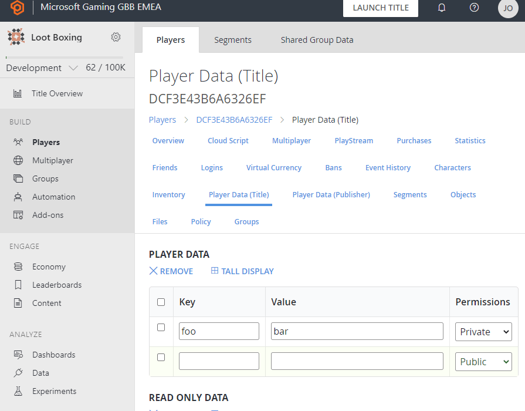

## Deploying the Function
Now that we have a working Azure Function, let’s deploy it to Azure!

> If you do not use Visual Studio, but want to use another IDE/Toolset, there are examples for creating & publishing Azure Function Apps with [Visual Studio Code](https://docs.microsoft.com/en-us/azure/azure-functions/functions-create-first-function-vs-code?pivots=programming-language-csharp) or via [CLI](https://docs.microsoft.com/en-us/azure/azure-functions/functions-create-first-azure-function-azure-cli?tabs=bash%2Cbrowser&pivots=programming-language-csharp).

### Deploy with the "Publish" command
To get started and for the sake of this demo, we will be using “right click deploy”, the deployment mechanism integrated in Visual Studio. While this is convenient for a demo, please consider [Azure DevOps](https://dev.azure.com/) or [GitHub Actions](https://github.com/features/actions) to build your Continuous Integration & Continuous Deployment (CI/CD) pipelines for a real project – because *“Friends don’t let Friends right-click publish!”*

In Visual Studio, right-click the project and click “Publish”:

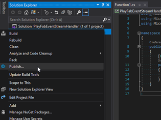

This will open a dialog where you can configure to which Azure Function App you want to deploy – and you can even create a new one using this dialog!

While this deployment dialog also supports other deployment methods, please select “Azure”.

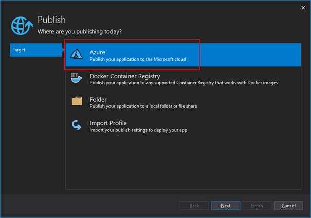

Then, “*Azure Functions App (Windows)*”.

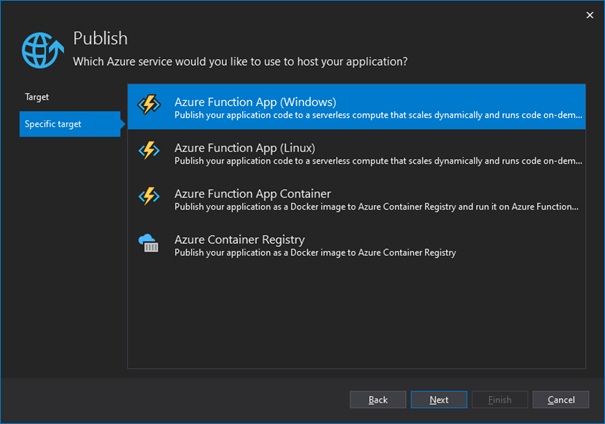

In the following Dialog you can choose the Azure Function App or slot beneath an app to deploy to.

If you haven’t already created an Azure Function App to deploy to, you can use the “*Create a new Azure Function…*” link to do so:

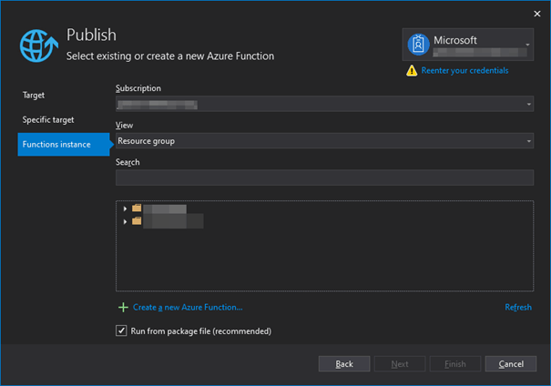

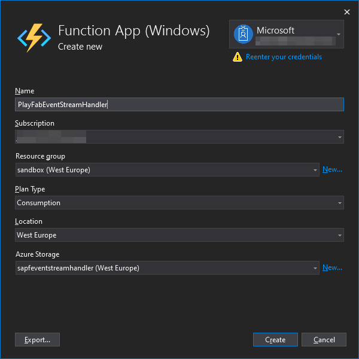

Now select the Function App you want to deploy to:

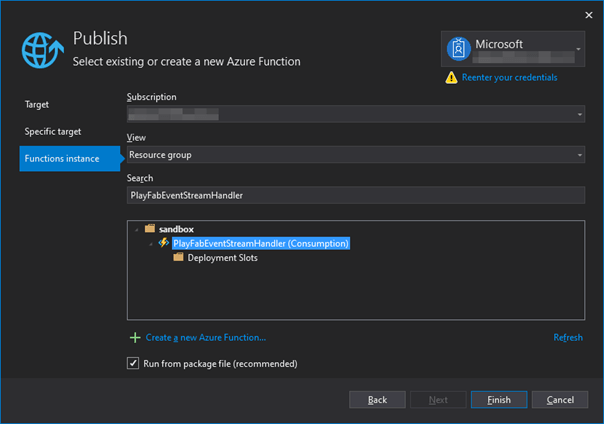

Once selected, Visual Studio will pull the “Publishing Profile” from Azure.

> If there is an exclamation mark warning symbol somewhere, hover over it to know why. In the screenshot below, my Storage configuration was not properly configured for the Publish wizard to work with, so I had to fix this.

Now click “Publish” to deploy your Azure Function App.

### Testing the online Function
Since you have now deployed the Azure Function, let's go ahead and test it.

First, make sure no local instance of the Function is running, so it is not competing against the online Azure Function when reading from the Azure Storage Queue.

Next, launch the `game-cli` again, which should log-in a new Account and trigger the Function via the Storage Queue.

You should now see the entry we created in the PlayFab data.

# Conclusion
In this article, we learned how to extend PlayFab by reacting to PlayFab PlayStream events with Azure Functions using Rules in PlayFab.

# Taking it further
Another possibility is to use Azure Functions to extend PlayFab even further, like enabling real-time messaging with [Azure SignalR Service](https://azure.microsoft.com/en-us/services/signalr-service/) or a global database like [CosmosDb](https://azure.microsoft.com/en-us/services/cosmos-db/)!

# Apendix
## Notes
* You might want to use [Azure Key Vault](https://azure.microsoft.com/en-us/services/key-vault/) for secrets instead of AppSettings, or [Azure Managed Identities](https://docs.microsoft.com/en-us/azure/app-service/overview-managed-identity?tabs=dotnet), for even more security.
